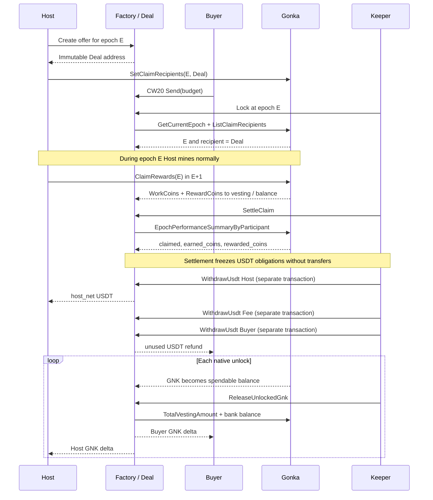
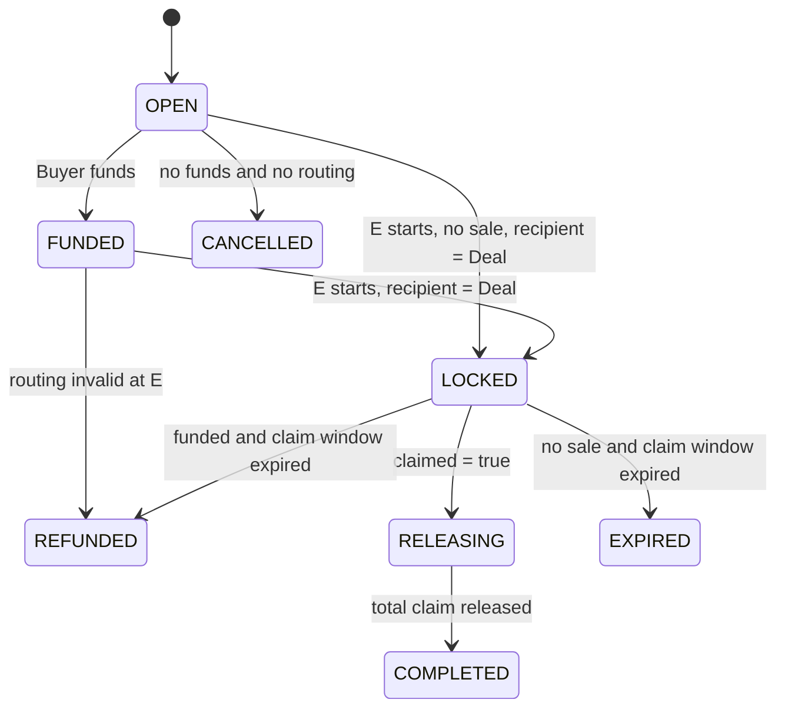

# Gonka Forward Marketplace MVP

## High-Level Technical Design

Status: Target architecture for team review, `GO WITH CAVEATS`
Base Gonka version: `379bebced638aeb5e6077bfd51c986f898443832`
Source code review date: 2026-09-04

Related documents:

- [`marketplace-mvp-spec.md`](marketplace-mvp-spec.md) — CosmWasm specification;
- [`gonka-chain-integration.md`](gonka-chain-integration.md) — Gonka patch and real-chain E2E integration;
- [Architecture Decision Records](decisions/) — normative architecture decisions.

## 1. Decision

Forward Marketplace sells not merely `RewardCoins`, but a Buyer-budget-bounded portion of the Host's total GNK output for a single future epoch:

```text
total_claim_gnk = RewardCoins + WorkCoins
```

For each deal, the Factory creates an isolated immutable Deal Contract. The Host pre-configures its address as the claim recipient for epoch E. The Buyer deposits CW20 USDT into the same Deal Contract. Following `ClaimRewards(E)`, the contract records total claim, settles immediately with the Host in USDT, and subsequent permissionless calls distribute unlocking GNK between Buyer and Host.

```text
Host mines -> Gonka ClaimRewards -> streamvesting -> Deal Contract -> Buyer + Host
Buyer USDT --------------------------> Deal Contract -> Host + fee + refund
```

Architectural verdict: `GO WITH CAVEATS`.

- `VERIFIED FROM SOURCE`: The code path accepts Bech32 `sdk.AccAddress`, both claim components route to a single address, vesting is stored and unlocked by address.
- `VERIFIED FROM SOURCE`: A global contract is unsuitable for clean attribution because vesting schedules aggregate by recipient address.
- `INFERENCE`: A CosmWasm address must traverse this path as a standard `sdk.AccAddress`, and native transfer must increment its bank balance without invoking execute.
- `VERIFIED BY LOCAL E2E`: Not yet executed; this is the P0 gate.

## 2. MVP Goals

- One deal links one Host, one Buyer, and one future epoch.
- Host pre-records Deal Contract address as claim recipient.
- Buyer purchases GNK from combined `RewardCoins + WorkCoins` at a fixed price.
- Buyer never receives GNK beyond funded capacity for free.
- Host retains all GNK exceeding the volume purchased by Buyer.
- Host receives USDT upon confirmed claim, without waiting for full vesting.
- Unlocking GNK is split deterministically and without a trusted backend.
- Deal contracts are immutable, lacking admin withdrawal and migration admin.

## 3. Pinned Product Decisions

| Area | MVP Decision |
|---|---|
| Granularity | One Host, one Buyer, one future epoch |
| Offer creator | Host |
| GNK recipient | Dedicated Deal Contract for each deal |
| Asset sold | GNK from `RewardCoins + WorkCoins` |
| Price | Integer `microUSDT` per 1 GNK |
| USDT | Single immutable CW20 with `decimals = 6` |
| Funding | Single Buyer, exact budget, no partial fill |
| Underproduction | Buyer receives full claim, Host receives USDT for actual volume, unused USDT refunded |
| Overproduction | Buyer receives only funded volume, Host receives remaining GNK |
| Fee | 150 bps from successful gross Host payout |
| Oracle | Not used |
| Vesting | Buyer accepts Gonka native liquidity schedule |
| Upgrade | Deal Contract without migration admin; new logic requires new code/deployment |

## 4. Architecture

| Component | Responsibility |
|---|---|
| Factory | Creates dedicated immutable Deal Contract and indexes deals |
| Deal Contract | USDT escrow, claim record, GNK entitlement, release, and terminal state |
| CW20 USDT | Settlement asset |
| Gonka inference | Epoch, claim recipient, `RewardCoins`, `WorkCoins`, `claimed` |
| Gonka streamvesting | Storage and sequential unlocking of GNK to Deal Contract address |
| Host | Creates offer, signs `SetClaimRecipients`, mines, and calls `ClaimRewards` |
| Buyer | Funds offer prior to start of E |
| Keeper | Calls permissionless `Lock`, `SettleClaim`, `ReleaseUnlockedGnk`, `Refund` |

### 4.1 Why One Deal Contract per Deal

`streamvesting.Keeper.VestingSchedules` is a `Map<sdk.AccAddress, VestingSchedule>`. `AddVestedRewards` adds new amounts to the address's existing schedule. If multiple deals share a recipient, their tranches merge, preventing the contract from provably attributing specific unlocks to specific deals.

Therefore, for MVP, address isolation is an intrinsic part of the correctness model, not merely a deployment preference:

```text
Factory -> Deal Contract E/Host #1
        -> Deal Contract E/Host #2
        -> Deal Contract E/Host #3
```

## 5. Deal Lifecycle

The diagram is embedded in Markdown and renders in IDEs/renderers supporting Mermaid.



### 5.1 States



`LOCKED` supports two modes: funded deal and no-sale passthrough. In the latter, Buyer is absent, `buyer_gnk_entitlement = 0`, and the full claim upon unlock returns to the Host.

### 5.2 Time Boundaries

| Point | Action |
|---|---|
| Before E | Create Deal, `SetClaimRecipients(E, Deal)`, funding, or cancellation of unfunded offer |
| `current = E` | Preferred verification of immutable routing and transition to `LOCKED` |
| `current = E+1` | Host invokes `ClaimRewards(E)`; permissionless settlement records claim and USDT |
| `current >= E+2` | If claim did not occur, funded deal refunds USDT |
| After each unlock | Any caller invokes `ReleaseUnlockedGnk` |

Pinned source retains recipient rows with pruning threshold 5; late `Lock` is possible only while the record provably exists. Following potential pruning, row absence cannot be interpreted as invalid routing; missing the entire window is a liveness failure.

## 6. Economics

All GNK values within the contract are stored in `ngonka`; all USDT values — in `microUSDT`.

```text
GNK_SCALE = 1_000_000_000

funded_capacity_ngonka = floor(
  buyer_budget_micro_usdt * GNK_SCALE / price_micro_usdt_per_gnk
)

total_claim_ngonka = rewarded_coins + earned_coins
buyer_entitlement   = min(total_claim_ngonka, funded_capacity_ngonka)
host_entitlement    = total_claim_ngonka - buyer_entitlement

gross_usdt = floor(
  buyer_entitlement * price_micro_usdt_per_gnk / GNK_SCALE
)
fee          = floor(gross_usdt * 150 / 10_000)
host_net     = gross_usdt - fee
buyer_refund = buyer_budget_micro_usdt - gross_usdt
```

Calculations are performed via checked `Uint256` intermediates with validated cast to `Uint128`.

### 6.1 Mandatory Examples

| Claim | Funded Capacity | Buyer GNK | Host GNK | Gross USDT at 1 USDT/GNK |
|---:|---:|---:|---:|---:|
| 50 Reward + 2 Work = 52 | 100 | 52 | 0 | 52 |
| 90 Reward + 10 Work = 100 | 100 | 100 | 0 | 100 |
| 100 Reward + 100 Work = 200 | 100 | 100 | 100 | 100 |
| 100,000 total | 4,000 | 4,000 | 96,000 | 4,000 |
| 0 | 100 | 0 | 0 | 0 |

The WorkCoins/RewardCoins ratio does not alter price or final ownership rights.

## 7. Vesting and Unlock Distribution

Following `claimed=true`, the contract stores `total_claim`, `buyer_entitlement`, and `host_entitlement`. For each release, it retrieves remaining vesting GNK for the Deal Contract address and bank balance.

```text
remaining_vesting = TotalVestingAmount(Deal)[ngonka]
cumulative_unlocked_cap =
  total_claim - min(total_claim, remaining_vesting)

new_released_total = min(
  cumulative_unlocked_cap,
  released_total + current_spendable_ngonka_balance
)

buyer_target = floor(
  new_released_total * buyer_entitlement / total_claim
)
host_target = new_released_total - buyer_target

buyer_delta = buyer_target - buyer_released
host_delta = host_target - host_released
```

At `new_released_total = total_claim`, the formula provides Buyer and Host exact final entitlements. Rounding errors do not compound across tranches because cumulative targets are recalculated each time.

Differing unlock periods for WorkCoins and RewardCoins only alter the schedule profile of total unlock. They do not alter the final split between parties.

## 8. Gonka Modification

The target patch remains a small read-only allowlist expansion, but requires four rather than three queries:

```text
/inference.inference.Query/GetCurrentEpoch
/inference.inference.Query/ListClaimRecipients
/inference.inference.Query/EpochPerformanceSummaryByParticipant
/inference.streamvesting.Query/TotalVestingAmount
```

Standard CosmWasm bank balance query does not require a Gonka-specific allowlist entry.

Reward calculations, `SetClaimRecipients`, `ClaimRewards`, streamvesting writes, bank logic, and protobuf definitions remain unchanged.

## 9. Convergence Point of Workstreams A and B

| Invariant | Workstream A | Workstream B |
|---|---|---|
| Pinned SHA | Generated types and README pin SHA | Chain/E2E build on same SHA |
| Deal address | Factory creates immutable per-deal address | Proves address is accepted by recipient path |
| Routing | Requires exact `(Host,E) -> Deal` | Proves future-only setter and retention |
| Claim total | Uses `earned_coins + rewarded_coins` strictly from chain query | Proves summary matches actual claim |
| Claim proof | USDT payout strictly upon `claimed=true` | Proves claim atomicity and zero-claim path |
| Unlock proof | Cumulative release and exact final split | Proves schedule, bank unlock, and native send from contract |
| Query boundary | Decodes four agreed responses | Exposes strictly the same four paths |

## 10. Core Risks and Invariants

- Buyer does not receive more than `buyer_entitlement` from claim.
- Host does not receive USDT prior to `claimed=true`.
- `host_net + fee + refund = buyer_budget`.
- `buyer_entitlement + host_entitlement = total_claim`.
- `buyer_released + host_released = released_total <= total_claim`.
- Query, decode, or arithmetic errors do not evaluate to zero and do not move funds.
- Native GNK transfer to contract is not treated as callback.
- Repeated release transfers only new delta.
- Extraneous liquid GNK does not inflate `cumulative_unlocked_cap`.
- Extraneous vested GNK can only conservatively delay release, never inflate entitlement; this is a known liveness risk.
- Following `COMPLETED`, permissionless `ForwardExcessGnk` can forward excess `ngonka` strictly to the fixed Host address and does not mutate claim counters.
- A single recipient address is never reused across two deals.
- No owner, manual settlement, arbitrary recipient, or migration admin.

## 11. Old vs New MVP

| Criterion | Old Direct-Buyer | New Deal Contract |
|---|---|---|
| Claim routing | Host -> Buyer | Host -> Deal -> Buyer + Host |
| Price | RewardCoins only | RewardCoins + WorkCoins |
| Overproduction | Buyer receives free excess | Excess GNK retained by Host |
| Capital efficiency | Requires large cap or risk of overdelivery | Buyer funds only required capacity |
| Host incentive to claim | May degrade under large excess | Excess retained by Host |
| Vesting | Entirely on Buyer address | On per-deal address with permissionless split |
| Contract complexity | Lower | Higher: Factory, native GNK, and release accounting |
| Gonka patch | 3 read queries | 4 read queries |
| Isolation | Storage row | Isolated address and vesting schedule |
| Audit surface | Smaller | Larger, but fixed price becomes economically sound |

Recommendation: Adopt the new model following P0 real-chain spike. Economic correctness and Host incentives outweigh additional complexity, but immutable deployment prior to exhaustive verification of recipient/vesting path is unacceptable.

## 12. Implementation Plan

| Phase | Output |
|---|---|
| 0. Feasibility spike | Real Gonka validates contract recipient, vesting, unlock, and BankMsg split |
| 1. Freeze interface | Four query paths, protobuf types, and SHA pinned |
| 2. Parallel build | A implements Factory/Deal; B implements allowlist and testnet |
| 3. Contract verification | Unit, property, and multi-test for economics and release |
| 4. Golden E2E | Full funded lifecycle on clean local Gonka |
| 5. Adversarial E2E | Wrong routing, no claim, donation, repeat release, mixed vesting |
| 6. Audit and deploy | Final addresses, checksums, no admin, closed P0 gates |

## 13. Excluded from MVP

- Multiple Buyers or Hosts in a single deal.
- Epoch ranges and pools.
- Partial funding/fill.
- Multiple settlement tokens.
- GNK/USDT oracle.
- Distinct prices for WorkCoins vs RewardCoins.
- Automated `ClaimRewards` on behalf of Host.
- Host collateral and Buyer compensation beyond refund.
- Referrals, pauses, governance-controlled economics, migration.

## 14. Release Gates and Questions for Core Team

| Gate | Status |
|---|---|
| Contract address accepted by `SetClaimRecipients` | Source-positive, real-chain unverified |
| `AddVestedRewards` stores schedule by contract address | Source-positive, real-chain unverified |
| `ProcessEpochUnlocks` produces spendable contract balance | Source-positive, real-chain unverified |
| Bank transfer does not invoke execute | Source-positive inference, real-chain unverified |
| Contract `BankMsg::Send` transfers GNK to Buyer and Host | Used by existing Gonka contracts, golden E2E mandatory |
| `claimed=true` atomically reflects successful claim | Test or core confirmation needed for rare write-error path |
| Recipient retention sufficient for `Lock` | Source threshold 5; E2E needed for actual pruning/backlog |
| Impact of third-party vested donation | Financially fail-safe, but potential delay; team must accept risk or request native provenance query |
| Production SHA, CW20 USDT, fee recipient | Final values required |

## 15. Summary

The target model is Factory plus one immutable Deal Contract per deal. The Buyer acquires a budget-capped quantity of GNK from the Host's total claim. The Host receives USDT immediately upon confirmed claim and retains GNK overproduction. Native vesting remains within Gonka; the Deal Contract merely distributes the actually unlocked aggregate stream.

The design is ready for feasibility spike and parallel implementation. For immutable production, it remains conditional on complete real-chain verification of the `SetClaimRecipients(Deal) -> ClaimRewards -> streamvesting -> contract balance -> release` path.
